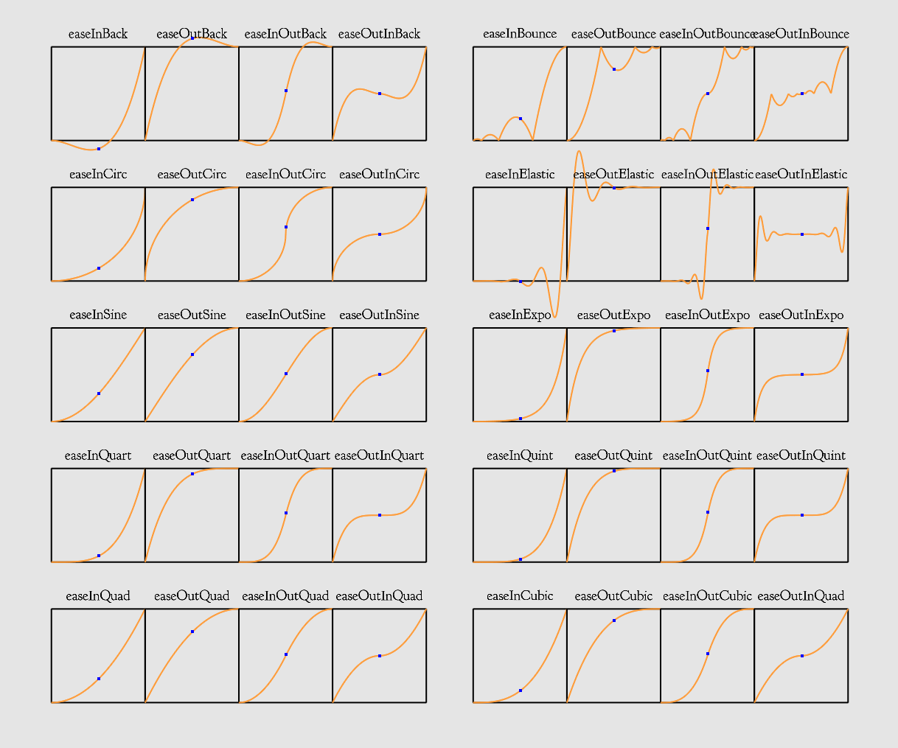

# OpenGLStarter

[Back to HOME](../index.md)

## C++ Easing Equations

[Robert Penner](http://robertpenner.com/easing/) created a set of interpolation functions considering the smooth variation of a parameter using several equations.

His equations create a different dynamics feeling when you interpolate the values.

The library has all the equations Robert Penner created, and if you want, you can create your own interpolation function also.

Look at the example below:

```cpp
//with numbers
{
  float a = 0.0f;
  float b = 1.0f;
  float c = easeOutExpo(a,b,0.5f);
}
//with vectors
{
  vec3 a(1.0f,0.0f,0.0f);
  vec3 b(0.0f,1.0f,0.0f);
  vec3 c = easeOutElastic(a,b,0.5f);
}
//with mat4
{
  mat4 a = translate(vec3(1.0f,0.0f,0.0f));
  mat4 b = translate(vec3(0.0f, 1.0f, 0.0f));
  mat4 c = easeOutCirc(a,b,0.5f);
}
```

The project __aribeiro-text-easing-eq__ render all equations. You can see the print screen below:


